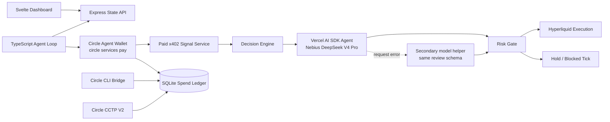

# HyperFlow

HyperFlow is a TypeScript agent workflow where a Circle Agent Wallet buys paid market intelligence, logs the spend, asks Nebius for a second-pass review, and executes the approved action on Hyperliquid testnet. If the primary review request fails, the backend uses a configured secondary model helper for the same review contract; the dashboard does not expose a separate provider panel.

It is not a standalone payment demo. The wallet is part of the operating loop: pay for the signal, attach the receipt to the decision, enforce budget/risk policy, then trade or hold.

## Architecture



## Submission Fit

| Requirement | Status | Implementation |
| --- | --- | --- |
| Circle Agent Wallet | ✓ | `circleAgentWallet.address` plus Circle CLI agent session |
| Wallet action | ✓ | `circle services pay` in [src/circle-agent-wallet.ts](src/circle-agent-wallet.ts) |
| Agent framework | ✓ | Vercel AI SDK `ToolLoopAgent` in [src/nebius.ts](src/nebius.ts) |
| Agent workflow | ✓ | paid signal -> AI SDK Nebius agent review -> risk gate -> Hyperliquid action |
| Budget cap | ✓ | `circleAgentWallet.maxUsdcPerCall` maps to `--max-amount` |
| Receipt / spend ledger | ✓ | SQLite `agent_wallet_spend_ledger` table and dashboard view |
| Crosschain support | ✓ | Circle bridge and CCTP routes for configured testnet flows |
| Frontend | ✓ | Svelte dashboard served by [src/dashboard.ts](src/dashboard.ts) |
| TypeScript port | ✓ | Runtime source is under [src](src) and builds with `tsc` |

## What Runs

| Runtime path | Status | Purpose |
| --- | --- | --- |
| Circle payment | ✓ | pays the live x402 signal endpoint |
| Spend logging | ✓ | stores seller, chain, amount, tx hash, and raw receipt |
| Nebius agent review | ✓ | DeepSeek V4 Pro through Vercel AI SDK; secondary model helper is used only after a primary request failure |
| Hyperliquid execution | ✓ | submits approved actions through the TypeScript SDK |
| Dashboard | ✓ | shows wallet state, ledger, decisions, and bridge history |
| Agent Wallet bridge | ✓ | Arc Testnet -> Base Sepolia through Circle CLI |
| CCTP | ✓ | Arc Testnet -> Arbitrum Sepolia route when configured |

## Configuration

Public runtime settings are in [config/hyperflow.config.json](config/hyperflow.config.json):

| Config area | Contains |
| --- | --- |
| `services` | paid signal service URL |
| `arc` | Arc Testnet RPC, chain id, and USDC contract |
| `circleAgentWallet` | wallet address, chain, spend cap, and CLI timeouts |
| `circleBridge` | Arc Testnet -> Base Sepolia Agent Wallet funding route |
| `hyperliquid` | network, symbol, and master address |
| `risk` | confidence, leverage, loss, and position limits |
| `cctp` | Arc Testnet -> Arbitrum Sepolia timing and recipient |
| `nebius` | Nebius Token Factory base URL, DeepSeek V4 Pro model, and review limits |
| secondary review helper | secondary model settings used after primary review request failure |
| `process` | SQLite path, dashboard port, and loop interval |

Secrets are in [.env.example](.env.example). Keep the real `.env` local and uncommitted:

| Secret | Required for |
| --- | --- |
| `HL_API_WALLET_PK` | Hyperliquid API wallet signing |
| `NEBIUS_API_KEY` | live Nebius review |
| `CONSUMER_PK` | direct CCTP route |
| `CCTP_WALLET_PK` | standalone CCTP command |
| `X402_FACILITATOR_PK` | optional seller-side facilitator |
| `TG_BOT_TOKEN`, `TG_CHAT_ID` | optional Telegram alerts |

There is no `CIRCLE_API_KEY` in this flow. Circle Agent Wallet auth is handled by Circle CLI login/session.

## Setup

```bash
npm install
cp .env.example .env
npm run build
```

Authenticate the Circle Agent Wallet:

```bash
npm install -g @circle-fin/cli
circle wallet login <email> --type agent --init
circle wallet login --type agent --request <request-id> --otp <code>
circle wallet create --output json
circle wallet list --chain ARC-TESTNET --type agent --output json
circle wallet balance --address <address> --chain ARC-TESTNET --output json
```

Put the Agent Wallet address and chain in `config/hyperflow.config.json` under `circleAgentWallet`.

For Hyperliquid, create an API wallet in the Hyperliquid testnet UI, authorize it, then put the API wallet private key in `HL_API_WALLET_PK`. The public master account address goes in `config.hyperliquid.masterAddress`.

## Run

```bash
npm run start
```

The dashboard serves on `http://localhost:<statePort>`, normally `http://localhost:8086`.

Useful endpoints:

- `GET /health`
- `GET /state`
- `GET /agent-wallet`
- `GET /reality`
- `POST /circle-bridge/trigger?amount_usdc=1.0`

## Main Files

- [src/loop.ts](src/loop.ts): agent loop from paid signal to trade execution.
- [src/circle-agent-wallet.ts](src/circle-agent-wallet.ts): Circle CLI Agent Wallet payment wrapper and spend ledger.
- [src/nebius.ts](src/nebius.ts): Vercel AI SDK `ToolLoopAgent` using Nebius DeepSeek V4 Pro.
- [src/executor.ts](src/executor.ts): Hyperliquid TypeScript SDK execution.
- [src/risk.ts](src/risk.ts): budget, loss, leverage, and liquidation guardrails.
- [src/cctp.ts](src/cctp.ts): direct Circle CCTP V2 Arc Testnet to Arbitrum Sepolia route.
- [src/circle-bridge.ts](src/circle-bridge.ts): Circle CLI bridge transfer route.
- [src/App.svelte](src/App.svelte): dashboard UI.
- [AGENT_WALLET_COMPLIANCE.md](AGENT_WALLET_COMPLIANCE.md): judging-requirement mapping.

## PM2

```bash
pm2 start ecosystem.config.js
pm2 logs hyperflow
pm2 restart hyperflow
pm2 stop hyperflow
```

## Deploy

Railway is supported through the root [Dockerfile](Dockerfile). Add a Railway Volume at `/data` so SQLite and the Circle CLI agent-wallet session persist across deploys.

See [docs/DEPLOY_RAILWAY.md](docs/DEPLOY_RAILWAY.md) for the deploy checklist.

## Circle References

- Circle Agent Stack docs: https://developers.circle.com/agent-stack
- Agent Stack ecosystem kits: https://github.com/akelani-circle/agent-stack-ecosystem-kits
